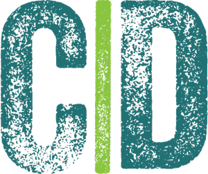

<h4 align="center">
   
  :brain: <b>Bem vindo ao Concepts-Dev !</b>
</h4>

  
  

 

### :gear: Technologies Used
Este projeto foi desenvolvido com as seguintes tecnologias:

#### Back-End
- [Node.js](https://nodejs.org/en/)
- [Express](https://expressjs.com/pt-br/)
- [Cors](https://www.npmjs.com/package/cors)

#### Front-End
- [React.js](https://pt-br.reactjs.org/)
- [Axios](https://www.npmjs.com/package/axios)
- [Babel/Cli](https://babeljs.io/docs/en/babel-cli)
- [Babel/Core](https://babeljs.io/docs/en/babel-core)
- [Babel/Preset-Env](https://babeljs.io/docs/en/babel-preset-env)
- [Babel/Preset-React](https://babeljs.io/docs/en/babel-preset-react)
- [Webpack](https://webpack.js.org/)
- [Webpack/Cli](https://www.npmjs.com/package/webpack-cli)
- [React-Dom](https://pt-br.reactjs.org/docs/react-dom.html)

### :brain: Project Description

#### Back-End
Nessa etapa foi criado uma API que contem um CRUD completo, com: GET, POST, PUT e DELETE.
Portanto, atraves dessa API pode criar projetos com seus title e owner usando o Insomnia como ferramenta para auxiliar na requisições.

#### Front-End

Nessa etapa foi criado um front que permite a conexão com a API[Back-End], com isso sendo possível a criação de novos projetos ao clique de button.